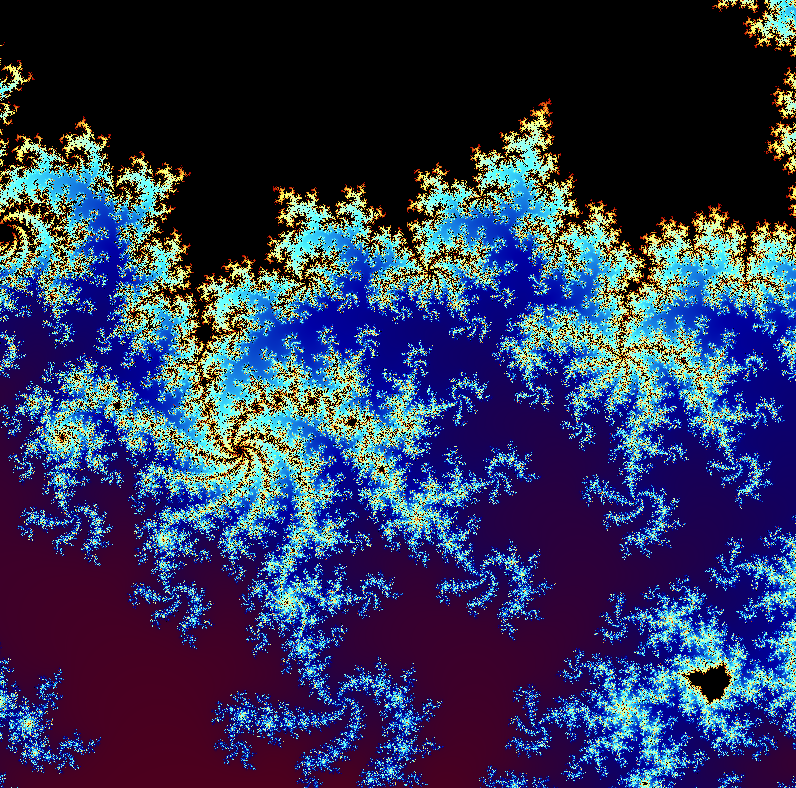
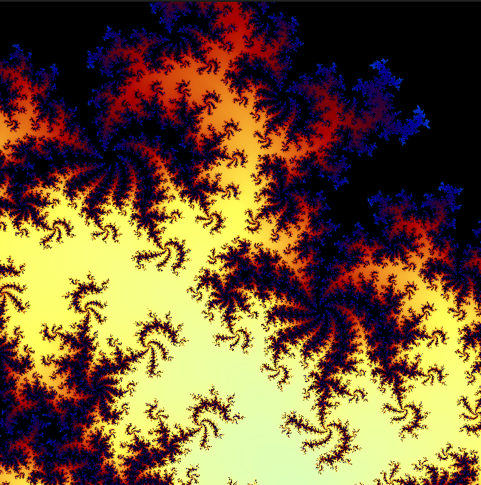
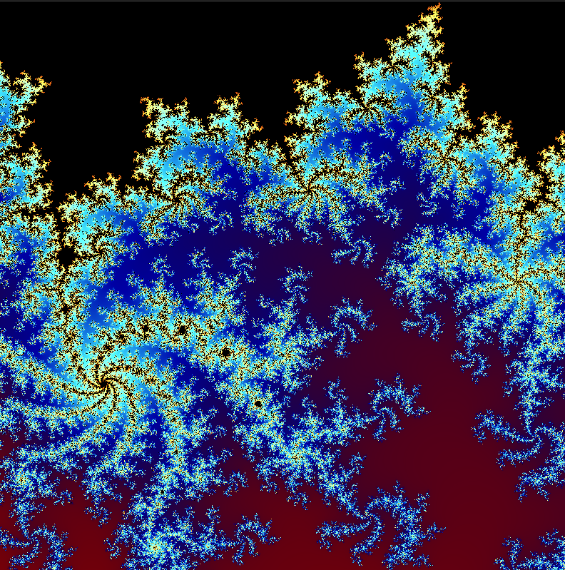
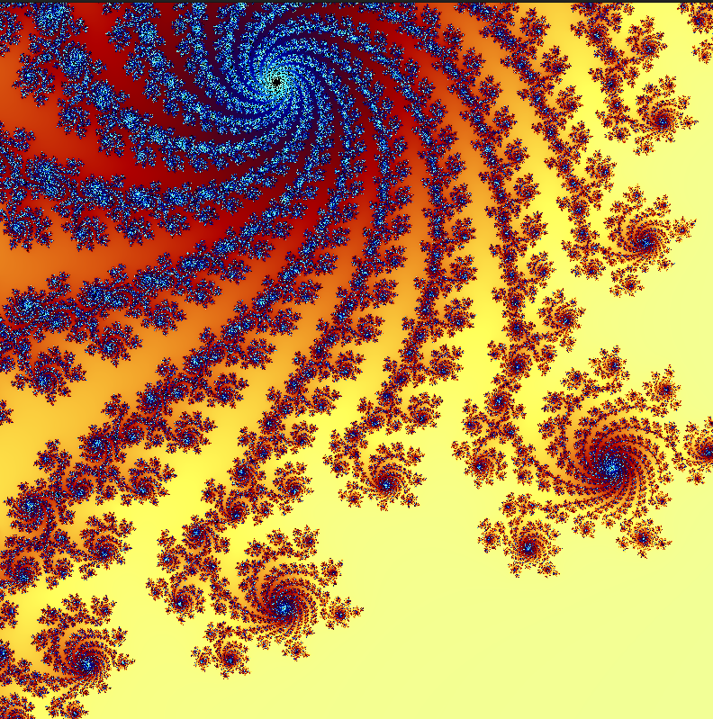
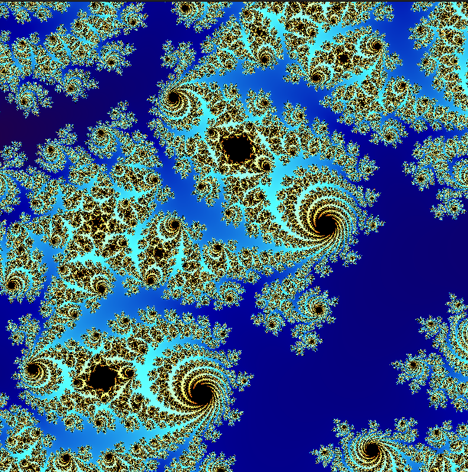
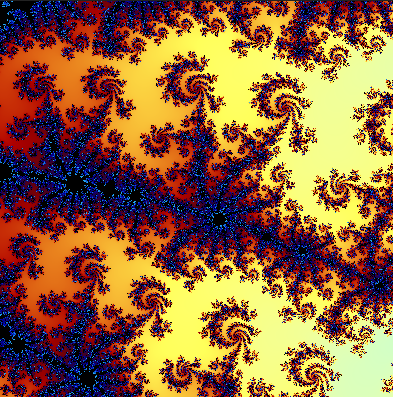

# Fractal Explorer
> A Mandelbrot set visualizer built with **OpenGL** and **C++**. With smooth zoom and animated color palettes.









## Controls
- **Mouse wheel**: zoom in/out
- **+ / -** : zoom 
- **R**: reset
- **ESC**: exit

## Requirements
- OpenGL 4.3
- GLFW3
- GLAD
- Linux/Unix system

## Building 
Run the script:
```bash
bash build.bash
```

then run the app:
```bash 
./app
```

or install the pre-built version from itch.io [here](www.google.com).

## Tech Stack
- OpenGL/GLSL
- GLFW
- GLAD 
- C++

## Costomize
- you can change this value if you want more zoom 
```glsl
#define MAX_ITERATIONS 500
```

